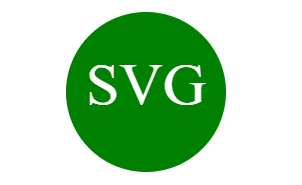

# SVG Logo Maker

## Description
SVG Logo Maker is a command-line application that allows users to create simple, custom SVG logos. The application prompts the user to select a shape, specify colors, and provide text. It then generates an SVG file that can be used for various purposes, such as personal projects or business branding.

## Features
* Shape Selection: Choose from three shapes—Circle, Triangle, or Square.
* Color Customization: Specify colors for both the shape and the text using either color keywords or hexadecimal values.
* Text Input: Enter up to three characters for the logo text.
* SVG Generation: Produces an SVG file with the specified shape, colors, and text.

## Getting Started

## Prerequisites
* Node.js (v14.0.0 or higher)
* npm (v6.0.0 or higher)

## Installation

### Clone the repository:
git clone https://github.com/yourusername/svg-logo-maker.git

### Navigate into the project directory:
cd svg-logo-maker

### Install the necessary dependencies:
npm install

## Usage
Run the application:

node index.js

Follow the prompts to enter the following details:

Text: Up to three characters for the logo.
Text Color: Color for the text (can be a keyword or hex code).
Shape: Choose between Circle, Triangle, or Square.
Shape Color: Color for the shape (can be a keyword or hex code).
After providing the inputs, the application will generate an SVG file named logo.svg in the examples/logos directory.

You will see a confirmation message in the command line:
*Generated examples/logos/logo.svg*

## Example
If you input "SVG" for the text, "white" for the text color, "Circle" for the shape, and "green" for the shape color, the generated SVG will look like this:

## File Structure
.
├── examples/               // Folder for example SVG files
│   └── logos/              // Folder for generated SVG logos
├── lib/                    // Folder for classes and functions
│   ├── colors.js           // Contains color validation functions
│   ├── shapes.js           // Defines shape classes (Circle, Triangle, Square)
│   └── text.js             // Defines SVGText class
├── .gitignore              // Specifies files and folders to ignore in Git
├── index.js                // Main application file
├── package.json            // Project metadata and dependencies
└── README.md               // This file

## Tests
The project uses Jest for testing. To run the tests:

npm test

## Troubleshooting
* Error generating SVG logo: TypeError: SVGText is not a constructor: Ensure that the SVGText class is correctly exported and imported. Verify the path to the text.js file is accurate.

* Text not centered correctly: Adjust the y value in the SVGText class for different shapes to fine-tune the text positioning.

## Contributing
Contributions are welcome! Please open an issue or submit a pull request with improvements, bug fixes, or additional features.

